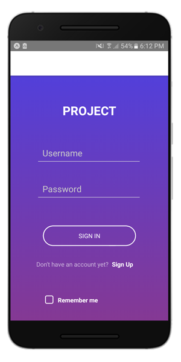
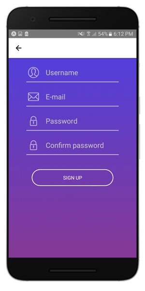

# React-Native-Capacitacion

1. Crear un proyecto nuevo con React Native
2. Entender los conceptos de `View`, `Text` y los 
StyleSheet con FlexBox creando un screen para Login,
Registrarse y Recordar contraseña.
3. Teniendo en cuenta las habilidades de diseño UX/UI
elaborar los screens con un buen diseño.

---

## Solución

- Screen Login

- Screen Registrarse

